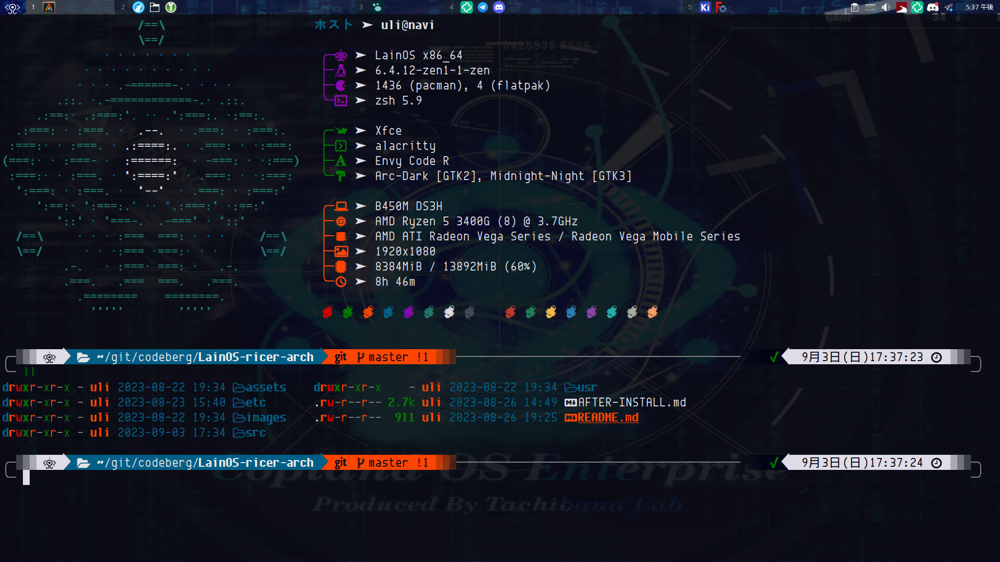
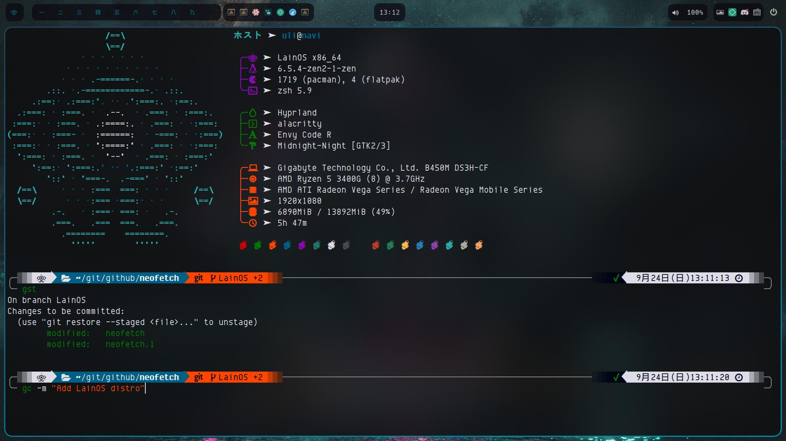

# this is a fork/modified version of the [Lain-OS-ricer-Arch](https://codeberg.org/LainOS/LainOS-ricer-arch)

> [!NOTE]
> please install yay before you run this!! \n
> dont forget run as root and not to just sudo it! \n
> this is a fork that may not work in the future, it works as of december 19th 2024 \n
> this fork exists becuase the original (at the time of writting this) is just fucking broken \n
> and does things such as aliasing nano to vim! I dont like this \n

## Openbox

## Hyprland

<!--toc:start-->
- [Objective](#objective)
- [Openbox](#openbox)
- [Hyprland](#hyprland)
- [More projects](#more-projects)
  - [LainOS ricer for MX Linux fluxbox](#lainos-ricer-for-mx-linux-fluxbox)
  - [PDL](#pdl)
  - [PDLP](#pdlp)
- [Social media](#social-media)
<!--toc:end-->
## Objective
The main purpose of these script is to provide customization of an fresh `Arch` installation to convert it into `LainOS`. Manual intervention could be needed.
This effort precede the creation of a iso image installer with a build script.
In support of the *Arch way* to install Arch Linux here are 2 [install guides](install_guides) to install it and then use the `Lain-ricer-arch.sh` script to rice it.

## More projects
Other projects from the LainOS team

### LainOS ricer for MX Linux fluxbox
[Ricer script](https://codeberg.org/LainOS/LainOS-ricer) to customize MX Linux fluxbox to LainOS.

### PDL
[PDL](https://github.com/ashk123/PDL) is a small tool for downloading and installing packages.

### PDLP
[PDL Packages](https://github.com/ashk123/PDLP) from users.

## Social media
&nbsp;&nbsp;
